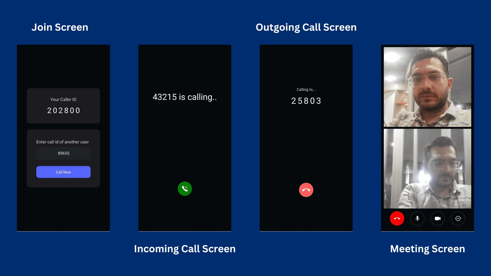

# WebRTC React Native App with Signalling



---
## Run the Sample App

Clone the repository to your local environment.

```js
git clone https://github.com/videosdk-live/webrtc.git
```

### Server Setup

#### Step 1: Go to server folder

```js

cd react-native-webrtc-app/server

```

#### Step 2: Install Dependency

```js

npm install
```

#### Step 3: Run the project

```js

npm run start
```

---

### Client Setup

#### Step 1: Go to client folder

```js

cd react-native-webrtc-app/client
```

### Step 2: Install the dependecies

```js
npm install
```

### Step 3: Provide your local Ip address in `SocketIOClient`.

in App.js file, update the Network Ip address.

```js
const socket = SocketIOClient("http://192.168.2.201:3500", {});
```

### Step 4: Run the sample app

Bingo, it's time to push the launch button.

```js
npm run start
npm android
npm ios
```
